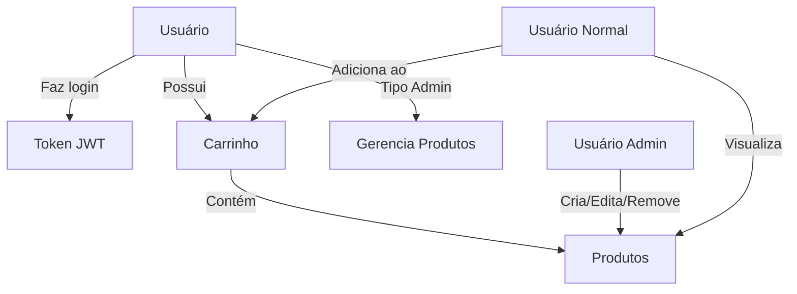

# ServeRest API - Documentação e Mapeamento

## Visão Geral

O **ServeRest** é uma API REST gratuita que simula uma loja virtual com o intuito de servir de material de estudos de testes de API. A API está hospedada em `https://compassuol.serverest.dev` e oferece funcionalidades completas para gerenciamento de usuários, produtos e carrinhos de compra.

## Estrutura da API

### Base URL
```
https://compassuol.serverest.dev
```

### Versão
```
2.29.7
```

## Endpoints Mapeados

### 1. Autenticação

#### POST /login
- **Descrição**: Realiza login no sistema
- **Autenticação**: Não requerida
- **Duração do Token**: 600 segundos (10 minutos)
- **Request Body**:
  ```json
  {
    "email": "string",
    "password": "string"
  }
  ```
- **Response (200)**:
  ```json
  {
    "message": "Login realizado com sucesso",
    "authorization": "Bearer {token}"
  }
  ```
- **Response (401)**:
  ```json
  {
    "message": "Email e/ou senha inválidos"
  }
  ```

### 2. Usuários

#### GET /usuarios
- **Descrição**: Lista usuários cadastrados
- **Autenticação**: Não requerida
- **Query Parameters**:
  - `_id` (string): Filtrar por ID
  - `nome` (string): Filtrar por nome
  - `email` (string): Filtrar por email
  - `password` (string): Filtrar por senha
  - `administrador` (string): Filtrar por tipo (true/false)

#### POST /usuarios
- **Descrição**: Cadastra novo usuário
- **Autenticação**: Não requerida
- **Request Body**:
  ```json
  {
    "nome": "string",
    "email": "string",
    "password": "string",
    "administrador": "string" // "true" ou "false"
  }
  ```

#### GET /usuarios/{_id}
- **Descrição**: Busca usuário por ID
- **Autenticação**: Não requerida

#### PUT /usuarios/{_id}
- **Descrição**: Edita usuário
- **Autenticação**: Não requerida

#### DELETE /usuarios/{_id}
- **Descrição**: Remove usuário
- **Autenticação**: Não requerida
- **Restrição**: Não permite excluir usuário que possui carrinho

### 3. Produtos

#### GET /produtos
- **Descrição**: Lista produtos cadastrados
- **Autenticação**: Não requerida
- **Query Parameters**:
  - `_id` (string): Filtrar por ID
  - `nome` (string): Filtrar por nome
  - `preco` (integer): Filtrar por preço
  - `descricao` (string): Filtrar por descrição
  - `quantidade` (integer): Filtrar por quantidade

#### POST /produtos
- **Descrição**: Cadastra novo produto
- **Autenticação**: **Requerida (Administrador)**
- **Request Body**:
  ```json
  {
    "nome": "string",
    "preco": "integer",
    "descricao": "string",
    "quantidade": "integer"
  }
  ```

#### GET /produtos/{_id}
- **Descrição**: Busca produto por ID
- **Autenticação**: Não requerida

#### PUT /produtos/{_id}
- **Descrição**: Edita produto
- **Autenticação**: **Requerida (Administrador)**

#### DELETE /produtos/{_id}
- **Descrição**: Remove produto
- **Autenticação**: **Requerida (Administrador)**
- **Restrição**: Não permite excluir produto que está em algum carrinho

### 4. Carrinhos

#### GET /carrinhos
- **Descrição**: Lista carrinhos cadastrados
- **Autenticação**: Não requerida
- **Observação**: Os carrinhos são únicos por usuário
- **Query Parameters**:
  - `_id` (string): Filtrar por ID
  - `precoTotal` (integer): Filtrar por preço total
  - `quantidadeTotal` (integer): Filtrar por quantidade total
  - `idUsuario` (string): Filtrar por ID do usuário

#### POST /carrinhos
- **Descrição**: Cadastra carrinho
- **Autenticação**: **Requerida**
- **Request Body**:
  ```json
  {
    "produtos": [
      {
        "idProduto": "string",
        "quantidade": "integer"
      }
    ]
  }
  ```

#### GET /carrinhos/{_id}
- **Descrição**: Busca carrinho por ID
- **Autenticação**: Não requerida

#### DELETE /carrinhos/concluir-compra
- **Descrição**: Finaliza compra (exclui carrinho)
- **Autenticação**: **Requerida**

#### DELETE /carrinhos/cancelar-compra
- **Descrição**: Cancela compra e retorna produtos para estoque
- **Autenticação**: **Requerida**

## Dependências e Relacionamentos

### Fluxo de Autenticação
1. **Login** → Gera token JWT
2. **Token** → Usado em operações que requerem autenticação
3. **Expiração** → Token expira em 10 minutos

### Relacionamentos entre Entidades



### Hierarquia de Permissões

#### Usuário Não Autenticado
- ✅ Visualizar usuários, produtos e carrinhos
- ✅ Criar conta de usuário
- ✅ Fazer login
- ❌ Gerenciar produtos
- ❌ Criar/gerenciar carrinhos

#### Usuário Autenticado (Não Admin)
- ✅ Todas as permissões de usuário não autenticado
- ✅ Criar e gerenciar próprio carrinho
- ✅ Finalizar/cancelar compras
- ❌ Gerenciar produtos

#### Usuário Administrador
- ✅ Todas as permissões de usuário autenticado
- ✅ Criar, editar e remover produtos
- ✅ Acesso completo à API

## Regras de Negócio

### Usuários
- Email deve ser único no sistema
- Não é possível excluir usuário que possui carrinho ativo

### Produtos
- Nome deve ser único no sistema
- Apenas administradores podem gerenciar produtos
- Não é possível excluir produto que está em algum carrinho

### Carrinhos
- Cada usuário pode ter apenas um carrinho ativo
- Carrinho é criado automaticamente ao adicionar produtos
- Finalizar compra remove o carrinho
- Cancelar compra remove o carrinho e reabastece o estoque

## Códigos de Status HTTP

| Código | Descrição |
|--------|-----------|
| 200 | Sucesso |
| 201 | Criado com sucesso |
| 400 | Erro de validação |
| 401 | Não autorizado |
| 403 | Acesso negado |
| 404 | Não encontrado |

## Estruturas de Dados

### Usuário
```json
{
  "_id": "string",
  "nome": "string",
  "email": "string",
  "password": "string",
  "administrador": "string"
}
```

### Produto
```json
{
  "_id": "string",
  "nome": "string",
  "preco": "integer",
  "descricao": "string",
  "quantidade": "integer"
}
```

### Carrinho
```json
{
  "_id": "string",
  "produtos": [
    {
      "idProduto": "string",
      "quantidade": "integer",
      "precoUnitario": "integer"
    }
  ],
  "precoTotal": "integer",
  "quantidadeTotal": "integer",
  "idUsuario": "string"
}
```

## Utilização das Collections Postman

### Pré-requisitos
1. Importar o Environment: `ServeRest_Environment.json`
2. Importar a Collection: `ServeRest_API_Collection.json`

### Ordem Recomendada de Execução
1. **Authentication/Login** - Para obter token de acesso
2. **Users/List Users** - Para visualizar usuários existentes
3. **Products/List Products** - Para visualizar produtos disponíveis
4. **Users/Create User** - Para criar novo usuário (se necessário)
5. **Products/Create Product** - Para criar produtos (requer admin)
6. **Shopping Cart/Create Cart** - Para criar carrinho
7. **Shopping Cart/Complete Purchase** - Para finalizar compra

### Testes Automatizados Incluídos
- ✅ Validação de códigos de status HTTP
- ✅ Validação de estrutura de resposta
- ✅ Validação de propriedades obrigatórias
- ✅ Extração automática de IDs para uso entre requisições
- ✅ Validação de tokens de autenticação
- ✅ Cenários de erro e validação de mensagens

### Variáveis de Ambiente
| Variável | Descrição |
|----------|-----------|
| `baseURL` | URL base da API |
| `authToken` | Token de autenticação (preenchido automaticamente) |
| `userId` | ID do usuário criado (preenchido automaticamente) |
| `productId` | ID do produto (preenchido automaticamente) |
| `cartId` | ID do carrinho (preenchido automaticamente) |
| `adminEmail` | Email do administrador padrão |
| `adminPassword` | Senha do administrador padrão |
| `userEmail` | Email para teste de usuário |
| `userPassword` | Senha para teste de usuário |

---

*Esta documentação foi gerada através da análise automatizada do Swagger da API ServeRest utilizando Playwright MCP para navegação e validação end-to-end da documentação.*
